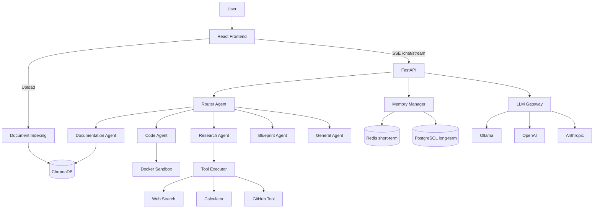

# NexusAI Architecture Analysis & Migration Plan

This document maps the **current codebase** against the production architecture goals, explains **what was already built**, what **gaps remain**, and the **phased migration plan** used to evolve NexusAI into a portfolio-grade AI SaaS platform.

---

## Executive summary

NexusAI is **not a greenfield chatbot**. It already has:

- LangGraph **supervisor** with 5 specialist agents
- **ChromaDB RAG** with reranking, project scoping, document indexing
- **Docker sandbox** (21 languages)
- **JWT auth**, projects, custom agents, analytics, code review
- React frontend with SSE streaming, dark mode, knowledge upload

The main gaps were **wiring and production polish**: memory not persisted on the streaming path, no callable tools, LLM switching env-only, no workflow persistence, and split chat execution paths.

**Phase 1 improvements (this release)** address the highest-impact gaps without rewriting the stack.

---

## Current architecture



---

## Requirement matrix

| # | Requirement | Status | Key paths |
|---|-------------|--------|-----------|
| 1 | Router Agent | **Done** | `graph/nodes/intent_classifier.py`, `services/router_service.py` |
| 2 | Multi-agent architecture | **Done** | `graph/agents/*.py`, `graph/supervisor.py` |
| 3 | RAG system | **Done** | `services/vector_store.py`, `services/document_indexing.py` |
| 4 | Long-term memory | **Improved** | `services/memory_service.py` — Redis + PG + prompt injection |
| 5 | Tool calling | **Added** | `tools/executor.py`, calculator, web search, GitHub |
| 6 | Code sandbox | **Done** | `services/code_executor.py`, `graph/agents/code_sandbox.py` |
| 7 | Workflow engine | **Foundation** | `db/models/workflow.py`, `api/routes/workflows.py` |
| 8 | Model switching | **Improved** | `services/llm.py`, `api/routes/config.py`, Settings UI |
| 9 | Frontend UX | **Strong** | Chat SSE, agents, knowledge, dark mode, dashboard |
| 10 | User workspace | **Partial** | Auth, projects, sessions — OAuth/teams pending |
| 11 | Database design | **Strong** | 13 models incl. workflows |
| 12 | Observability | **Basic** | Analytics, LangSmith opt-in — token metrics pending |
| 13 | Code quality | **Good** | Layered FastAPI, tests, CI |
| 14 | Phased approach | **This doc** | See migration phases below |

---

## What each Phase 1 change solves

### 1. Router Agent (`services/router_service.py`)

**Problem:** Routing logic was duplicated between LangGraph and SSE streaming.

**Solution:** Central `route_query()` + `resolve_agent_key()` used by both paths. UI shows **Router Agent** in the reasoning tree.

**Scalability:** New agents only need registry entry + graph node — routing stays in one place.

### 2. Tool calling (`app/tools/`)

**Problem:** Agents were single-shot LLM calls — no web search, math, or GitHub despite product requirements.

**Solution:** Modular tool executor with:
- `calculator` — safe AST evaluation
- `web_search` — DuckDuckGo via langchain-community
- `github_tool` — repo tree + README via GitHub API

**Scalability:** Add tools in `tools/` + register in `registry.py` — no agent rewrite.

### 3. Memory wiring (`memory_service.py`)

**Problem:** Redis context and PG long-term memory existed but were **never called** on the primary SSE chat path.

**Solution:**
- `build_prompt_context()` — injects recent turns + preferences into prompts
- `persist_turn()` — saves Redis short-term + PG long-term after every stream

**Scalability:** Memory layer is separate from agents — swap Redis/Chroma/PG without touching graph.

### 4. LLM Gateway per-user (`llm.py` + `config.py`)

**Problem:** Model provider required `.env` change + server restart.

**Solution:** User preferences stored in `User.preferences` JSON; `PATCH /api/v1/config/llm` + Settings UI selector.

**Scalability:** Gateway pattern supports per-org billing tiers later.

### 5. Workflow foundation

**Problem:** No persistence for user-defined Input → Agent → Tool → Output pipelines.

**Solution:** `workflows` table + CRUD API. Visual builder UI is Phase 7.

### 6. GitHub token storage

**Problem:** Connect validated token but didn't store it — GitHub tool couldn't run.

**Solution:** Token stored in encrypted user preferences (production should use secrets manager).

---

## Migration phases (roadmap)

### Phase 1 — Architecture improvement ✅ (this release)
- Router service unification
- Memory wiring on stream path
- Tool framework
- User LLM preferences API
- Workflow DB + API
- Dashboard page
- Architecture documentation

### Phase 2 — Agent system (next)
- ReAct tool loops for Research/Code agents
- Unify SSE to always run validation + memory nodes
- Agent confidence scores + fallback routing
- Custom agent tool assignments

### Phase 3 — RAG + Memory (next)
- Hybrid BM25 + vector search
- Memory CRUD UI + deduplication
- GitHub repo → RAG ingestion pipeline
- Embedding provider follows chat provider

### Phase 4 — Tools + Sandbox (next)
- Pre-built Docker images for compiled languages
- Runtime file read tool during chat
- Workflow runner (execute saved steps)

### Phase 5 — UI improvements (next)
- Visual workflow builder (Langflow-style)
- Mobile navigation
- Multi-document chat attach
- Mermaid dark mode sync

### Phase 6 — Production optimization (next)
- Google OAuth
- OpenTelemetry + token/cost metrics
- RBAC + org scoping
- Secrets manager for GitHub tokens
- Background job queue (Celery/Redis)

---

## Key directories

```
backend/app/
├── api/routes/       # REST endpoints
├── graph/            # LangGraph supervisor + agents
├── tools/            # Callable agent tools (NEW)
├── services/         # Business logic
└── db/models/        # SQLAlchemy models

frontend/src/
├── pages/            # Route pages
├── hooks/useChat.ts  # SSE streaming
├── stores/           # Zustand state
└── components/       # UI building blocks
```

---

## Running after upgrade

```bash
# Apply workflow migration
cd backend && .venv/bin/alembic upgrade head

# Restart backend
.venv/bin/uvicorn app.main:app --reload

# Frontend
cd frontend && npm run dev
```

---

## Portfolio talking points

When presenting NexusAI as an AI Engineer portfolio piece:

1. **Multi-agent orchestration** with LangGraph, not a single prompt wrapper
2. **RAG pipeline** with chunking, embeddings, reranking, project scoping
3. **Production patterns**: JWT auth, rate limits, Docker sandbox isolation, SSE streaming
4. **Tool-augmented agents** with modular executor architecture
5. **Memory layers** (Redis short-term + PostgreSQL long-term + vector semantic search)
6. **Observability** via analytics dashboard and optional LangSmith tracing

This demonstrates systems thinking — the difference between a demo chatbot and an AI platform.
