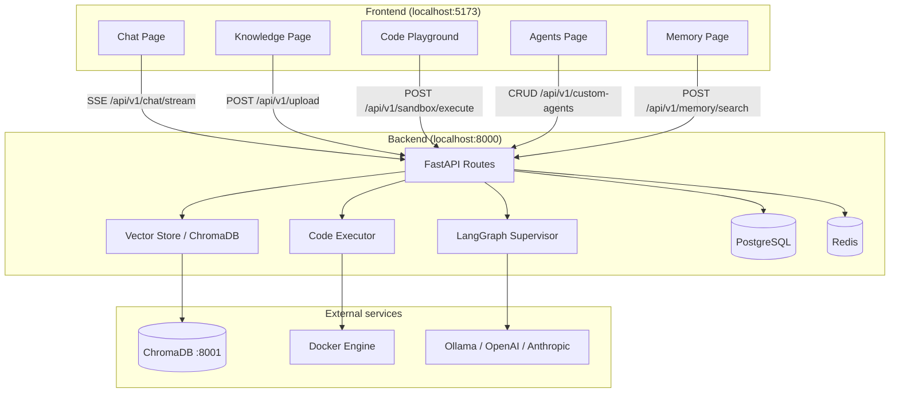
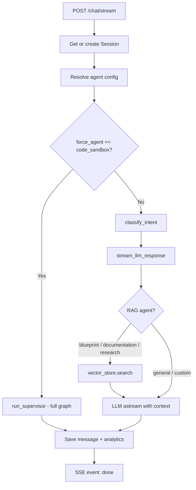
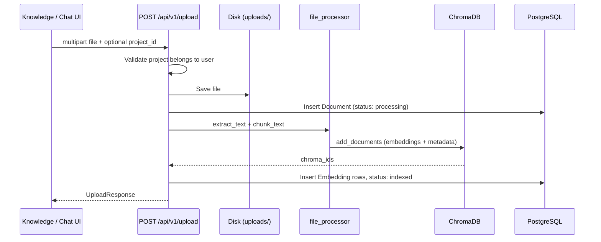
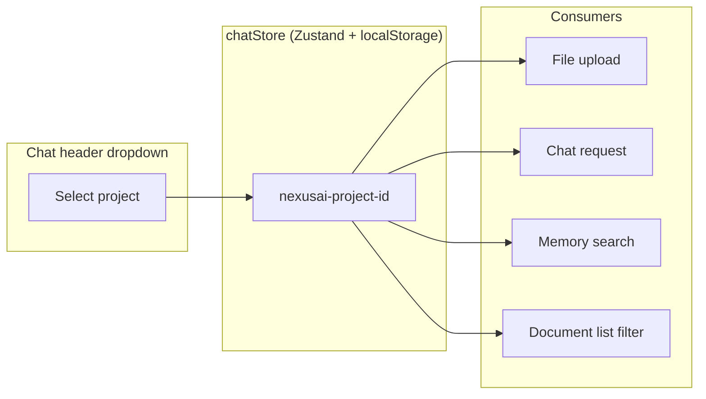
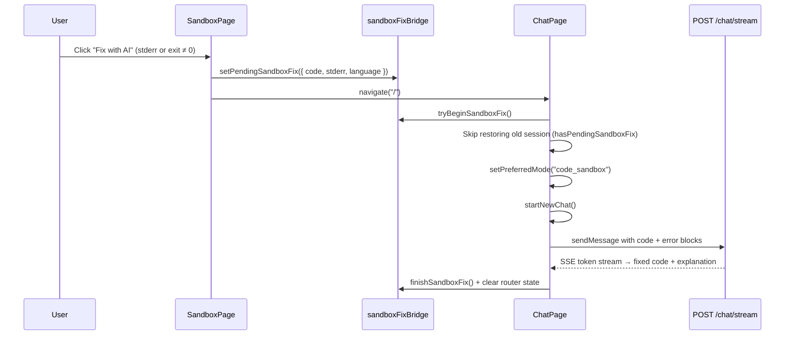
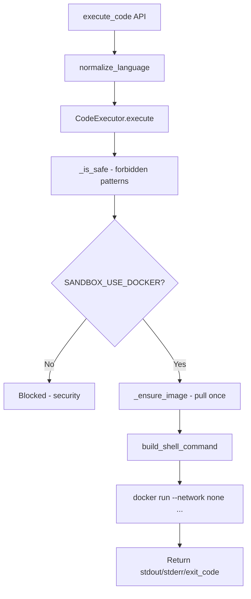
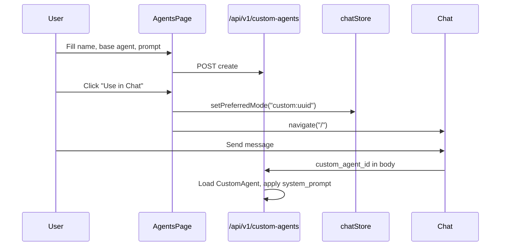

# NexusAI — Implementation Guide

This document explains **how NexusAI was built**, how the major features connect, and the **end-to-end flows** from the UI to the backend. Use it as a map when extending the product or onboarding new developers.

---

## Table of contents

1. [System overview](#1-system-overview)
2. [Chat & multi-agent routing flow](#2-chat--multi-agent-routing-flow)
3. [Knowledge upload & RAG flow](#3-knowledge-upload--rag-flow)
4. [Project scoping flow](#4-project-scoping-flow)
5. [Code Playground (sandbox) flow](#5-code-playground-sandbox-flow)
6. [Custom agents flow](#6-custom-agents-flow)
7. [Memory page flow](#7-memory-page-flow)
8. [Sandbox pre-warm on startup](#8-sandbox-pre-warm-on-startup)
9. [CI pipeline](#9-ci-pipeline)
10. [Key files reference](#10-key-files-reference)

---

## 1. System overview

NexusAI is a **multi-agent AI workspace**: the frontend (React + Vite) talks to a FastAPI backend that routes user messages through a **LangGraph supervisor**, optional **RAG** (ChromaDB), and a **Docker-isolated code sandbox**.



### Tech stack

| Layer | Technology |
|-------|------------|
| Frontend | React 19, Vite, TanStack Query, Zustand, CodeMirror |
| Backend | FastAPI, SQLAlchemy (async), LangGraph |
| Database | PostgreSQL (sessions, users, documents, memory) |
| Vectors | ChromaDB (document chunks for RAG) |
| Cache | Redis (session context, rate limiting) |
| Sandbox | Docker containers (21 languages, network disabled) |
| LLM | Ollama (default), OpenAI, or Anthropic via env |

---

## 2. Chat & multi-agent routing flow

When a user sends a message, the frontend opens an **SSE (Server-Sent Events)** stream. The backend either runs the **full LangGraph supervisor** (for Code Sandbox agent) or a **lighter streaming path** (intent classify → LLM stream with optional RAG).

### Frontend flow

```
User types message
    ↓
useChat.sendMessage()
    ↓
POST /api/v1/chat/stream
  body: {
    message,
    session_id,
    project_id,        ← from chatStore (localStorage)
    force_agent?,       ← if mode is not "auto"
    custom_agent_id?,   ← if mode is "custom:uuid"
    document_id?        ← if one file attached
  }
    ↓
SSE events: session → graph_event → token → done
    ↓
UI updates messages, reasoning tree, citations
```

**Key files**

- `frontend/src/hooks/useChat.ts` — builds request body, parses SSE
- `frontend/src/stores/chatStore.ts` — `projectId`, `preferredMode`, messages
- `frontend/src/pages/ChatPage.tsx` — UI, mode selector, reasoning panel

### Backend flow



**Agent resolution** (`backend/app/api/routes/chat.py`):

1. If `custom_agent_id` → load custom agent → use its `system_prompt` + `base_agent_key`
2. Else if `force_agent` → use that built-in agent
3. Else → **Auto mode** → intent classifier picks agent

**LangGraph pipeline** (`backend/app/graph/supervisor.py`):

```
START
  → intent_classifier
  → route_to_agent (conditional)
  → [code_sandbox | blueprint | documentation | research | general]
  → memory_update
  → response_validation
  → END
```

**Streaming split**

- **Code Sandbox agent**: full supervisor runs (may execute code in Docker inside the graph).
- **Other agents**: faster path — classify intent, stream tokens from LLM, attach RAG citations when relevant.

---

## 3. Knowledge upload & RAG flow

Uploaded files become **searchable knowledge** used by Documentation, Blueprint, and Research agents.

### Upload flow



**Metadata stored in Chroma** (per chunk):

```json
{
  "document_id": "uuid",
  "filename": "report.pdf",
  "chunk_index": 0,
  "project_id": "uuid"   // only if upload was scoped to a project
}
```

**Key files**

- `backend/app/api/routes/upload.py` — upload handler
- `backend/app/services/file_processor.py` — text extraction & chunking
- `backend/app/services/vector_store.py` — Chroma add/search
- `frontend/src/lib/api.ts` — `uploadFile(file, projectId?)`

### RAG retrieval flow (during chat)

When an agent with `use_rag=True` runs (or streaming path for blueprint/documentation/research):

```
User query
    ↓
vector_store.search(query, n_results, document_id?, project_id?)
    ↓
Optional reranker (if RAG_RERANK_ENABLED)
    ↓
Format as numbered sources [1], [2], …
    ↓
Inject into LLM system/user message
    ↓
Return citations to frontend in SSE "done" event
```

**Search filter priority** (`backend/app/services/vector_store.py`):

1. If `document_id` is set → search **only that document** (single-file chat).
2. Else if `project_id` is set → search **only chunks tagged with that project**.
3. Else → search **all knowledge**.

**Key files**

- `backend/app/graph/agents/base.py` — `_run_agent` with RAG
- `backend/app/services/rag_helpers.py` — `fetch_rag_citations` for streaming path
- `backend/app/services/chat_streaming.py` — `stream_llm_response`

---

## 4. Project scoping flow

Projects tie together **chat sessions**, **document uploads**, and **RAG search** under one workspace.

### How project ID travels



| Action | Where `project_id` is sent |
|--------|---------------------------|
| New chat session | `POST /sessions` body |
| Send message | `POST /chat/stream` body |
| Upload file (Chat or Knowledge) | `FormData project_id` |
| Memory semantic search | `POST /memory/search` body |
| List documents | `GET /documents?project_id=` |

**Before this implementation**: documents were uploaded without `project_id`, so Knowledge “filter by project” did not match indexed data. **After**: upload stores `project_id` on the `Document` row and in Chroma metadata; chat RAG respects the active project.

---

## 5. Code Playground (sandbox) flow

The Playground runs user code in **isolated Docker containers** — no host access, no network.

### User flow

```
SandboxPage
    ↓
User edits code (CodeMirror) + optional stdin
    ↓
Click Run (or Ctrl/Cmd+Enter)
    ↓
POST /api/v1/sandbox/execute { code, language, stdin }
    ↓
Display stdout / stderr / exit code / parsed stack trace
    ↓
Optional: Fix with AI → stores error context → navigates to Chat → AI explains & fixes
```

### Fix with AI flow

When code fails in the Playground, **Fix with AI** sends the failing code and error output to Chat and starts an automated fix conversation with the **Code Sandbox** agent.

#### End-to-end sequence



#### What gets sent to Chat

`ChatPage` builds a user message containing:

- A short intro: `Help me fix this {language} code:`
- A fenced code block with the playground source
- A fenced block with stderr (or `block_reason` for blocked runs)

The mode is forced to **`code_sandbox`** so the backend runs the full LangGraph supervisor (which can reason about and rewrite code).

#### Why a sessionStorage bridge (not only router state)

**Original approach**: pass `{ sandboxFix: { code, stderr, language } }` via React Router `location.state`.

**Problem**: React **StrictMode** (enabled in `frontend/src/main.tsx`) mounts components twice in development. The old handler cleared `location.state` immediately on first mount. On the second mount:

1. Router state was already `null` — fix context lost
2. Component refs reset — handler did not run again
3. Session-restore effect loaded the **previous chat** instead of starting a fix conversation

**Solution** (`frontend/src/lib/sandboxFixBridge.ts`):

| Function | Purpose |
|----------|---------|
| `setPendingSandboxFix()` | Playground writes payload to `sessionStorage` before navigation |
| `peekPendingSandboxFix()` | Read payload without consuming (used to skip session restore) |
| `hasPendingSandboxFix()` | True if storage has a fix or one is already in flight |
| `tryBeginSandboxFix()` | Atomically claim the fix; module-level `fixInFlight` prevents duplicate sends under StrictMode |
| `finishSandboxFix()` | Clear storage and reset in-flight flag after `sendMessage` completes |

Router `location.state` is still accepted as a **fallback** for backwards compatibility, but the primary handoff is sessionStorage. Navigation state is cleared only in a `finally` block **after** the chat message is sent.

#### Session-restore guard

On Chat mount, a session-restore effect normally reloads the last conversation from `localStorage` / URL `?session=`. That would overwrite the fix flow. The guard now skips restore when:

- `location.state.sandboxFix` is present, or
- `hasPendingSandboxFix()` is true (bridge has a pending fix)

#### UI trigger conditions

The **Fix with AI** button appears in the Output panel when:

- A run result exists, **and**
- `stderr` is non-empty **or** `exit_code !== 0`

Blocked runs (`block_reason`) also qualify — the block reason is passed as the error text.

### Execution pipeline (backend)



### Fix for “Execution timed out after 10s”

Two root causes were fixed:

#### Problem 1: Multiline code broke shell escaping

**Before**: code passed inline, e.g. `node -e "..."` — multiline JavaScript broke quoting and could hang.

**After**: code is **base64-encoded**, written to a file inside the container, then executed:

```bash
echo "<base64>" | base64 -d > /tmp/sandbox.js && node /tmp/sandbox.js
```

Implemented in `build_shell_command()` in `backend/app/services/code_executor.py`.

#### Problem 2: Docker image pull counted against run timeout

**Before**: `docker run` pulled images on first use (~18s for `node:20-alpine`) inside the 10s execution window → exit code **124**.

**After**:

1. `_ensure_image()` — `docker pull` once per image (120s pull timeout), cached in `_pulled_images`
2. `docker run --pull never` — run timeout applies only to execution
3. Default timeout raised to **45 seconds** (`SANDBOX_TIMEOUT_SECONDS`)

### Playground UI features

| Feature | Implementation |
|---------|----------------|
| CodeMirror editor | `frontend/src/components/sandbox/CodeEditor.tsx` |
| Toolbar (copy, reset, clear, share, history) | `frontend/src/pages/SandboxPage.tsx` |
| Run history | `frontend/src/lib/sandboxHistory.ts` (localStorage) |
| Share links | URL params `?lang=&code=` or `?code64=` |
| Stack traces | `StackTracePanel.tsx` + backend `parsed_trace` |
| Fix with AI | `sandboxFixBridge.ts` → Chat auto-starts Code Sandbox fix thread |
| Starter templates | `STARTER_TEMPLATES` in `code_languages.py` |

**Key files**

- `backend/app/services/code_executor.py`
- `backend/app/services/code_languages.py`
- `backend/app/api/routes/sandbox.py`
- `frontend/src/pages/SandboxPage.tsx` — editor, run, **Fix with AI** button
- `frontend/src/lib/sandboxFixBridge.ts` — durable Playground → Chat error handoff
- `frontend/src/pages/ChatPage.tsx` — consumes bridge, starts fix conversation

---

## 6. Custom agents flow

Users can define agents with a **custom system prompt** on top of a **base specialist** (general, research, documentation, etc.).

### Create & use flow



### Backend resolution

In `chat.py` → `_resolve_agent_config()`:

```python
if request.custom_agent_id:
    # Load from DB → return (base_agent_key, system_prompt, force_agent)
```

The custom prompt replaces the default system prompt in `_run_agent()` / `stream_llm_response()`.

### API endpoints

| Method | Path | Purpose |
|--------|------|---------|
| GET | `/api/v1/custom-agents` | List user's agents |
| POST | `/api/v1/custom-agents` | Create |
| PATCH | `/api/v1/custom-agents/{id}` | Update |
| DELETE | `/api/v1/custom-agents/{id}` | Archive (soft delete) |

**Key files**

- `backend/app/api/routes/custom_agents.py`
- `backend/app/db/models/custom_agent.py`
- `frontend/src/pages/AgentsPage.tsx`
- `frontend/src/hooks/useChat.ts` — `parseMode("custom:uuid")`

---

## 7. Memory page flow

The Memory page has **two panels**:

### A. Knowledge search (semantic)

Uses the same Chroma index as RAG:

```
User enters query
    ↓
POST /api/v1/memory/search { query, limit, project_id? }
    ↓
memory_service.semantic_search()
    ↓
vector_store.search() with optional project filter
    ↓
Display chunks with score + filename
```

### B. Conversation memory (PostgreSQL)

After each chat turn, the backend saves a snippet:

```
chat.py → memory_service.save_long_term(db, user_id, session_id, key, value)
    ↓
Stored in memory_entries table
    ↓
GET /api/v1/memory/entries → displayed on Memory page
```

**Key files**

- `backend/app/api/routes/memory.py`
- `backend/app/services/memory_service.py`
- `frontend/src/pages/MemoryPage.tsx`

---

## 8. Sandbox pre-warm on startup

To avoid slow first runs per language, the backend **pulls all sandbox Docker images in the background** when it starts.

```
app.main lifespan
    ↓
if SANDBOX_USE_DOCKER and SANDBOX_PREWARM_ON_STARTUP
    ↓
asyncio.create_task(prewarm_sandbox_images)
    ↓
For each unique image in LANGUAGE_CONFIGS → _ensure_image()
```

**Config**: `SANDBOX_PREWARM_ON_STARTUP=true` in `backend/.env`

**Note**: First backend start after install may still take 1–2 minutes while images download. Subsequent runs use cached images.

---

## 9. CI pipeline

GitHub Actions workflow (`.github/workflows/ci.yml`) runs on push/PR to `main` or `master`:

| Job | Steps |
|-----|--------|
| **backend** | Python 3.12 → `pip install -r requirements.txt` → `pytest tests/ -v` |
| **frontend** | Node 20 → `npm ci` → `npm run build` |

This catches regressions in sandbox helpers, chat schemas, supervisor routing, and TypeScript build errors.

---

## 10. Key files reference

### Backend

| File | Responsibility |
|------|----------------|
| `app/main.py` | App entry, lifespan, pre-warm, health checks |
| `app/config.py` | All env settings (sandbox, RAG, LLM, rate limits) |
| `app/api/routes/chat.py` | Chat + SSE streaming |
| `app/api/routes/upload.py` | File upload + indexing |
| `app/api/routes/sandbox.py` | Sandbox execute + languages |
| `app/api/routes/custom_agents.py` | Custom agent CRUD |
| `app/api/routes/memory.py` | Memory search + list entries |
| `app/graph/supervisor.py` | LangGraph orchestration |
| `app/graph/agents/base.py` | Shared agent runner + RAG |
| `app/services/code_executor.py` | Docker sandbox execution |
| `app/services/vector_store.py` | ChromaDB add/search |
| `app/services/rag_helpers.py` | RAG citations for streaming |
| `app/services/chat_streaming.py` | LLM token streaming |

### Frontend

| File | Responsibility |
|------|----------------|
| `src/pages/ChatPage.tsx` | Main chat UI |
| `src/pages/SandboxPage.tsx` | Code Playground |
| `src/lib/sandboxFixBridge.ts` | Playground → Chat “Fix with AI” handoff (sessionStorage) |
| `src/pages/KnowledgePage.tsx` | Document upload & preview |
| `src/pages/AgentsPage.tsx` | Built-in + custom agents |
| `src/pages/MemoryPage.tsx` | Knowledge search + memory list |
| `src/hooks/useChat.ts` | Chat SSE client |
| `src/stores/chatStore.ts` | Session, project, mode state |
| `src/lib/api.ts` | HTTP helpers + upload |

### Infrastructure

| File | Responsibility |
|------|----------------|
| `docker-compose.yml` | Postgres, Redis, Chroma, backend, frontend |
| `render.yaml` | Backend deploy on Render |
| `frontend/vercel.json` | Frontend deploy on Vercel |
| `.github/workflows/ci.yml` | CI tests + build |

---

## Environment checklist

Before running locally:

```bash
# 1. Start dependencies
docker compose up -d postgres redis chromadb

# 2. Backend
cd backend
source .venv/bin/activate
alembic upgrade head
uvicorn app.main:app --reload --port 8000

# 3. Frontend
cd frontend
cp .env.example .env.local   # if needed
npm run dev
```

**Required for sandbox**: Docker Desktop running, `SANDBOX_USE_DOCKER=true`.

**After changing sandbox or project code**: restart the backend.

---

## Knowledge base & PDF preview flow

### Upload with progress

```
User drops/selects file on KnowledgePage
    ↓
uploadFileWithProgress() via XMLHttpRequest
    ↓
Progress bar updates (0–100%)
    ↓
POST /api/v1/upload (multipart + optional project_id)
    ↓
Rate limit check (30 uploads/hour per user via Redis)
    ↓
index_document() → Chroma + PostgreSQL embeddings
```

### PDF preview (no forced download)

**Problem fixed:** `FileResponse` defaulted to `Content-Disposition: attachment`, which triggered browser downloads.

**Solution:**

1. Backend serves previewable files with `content_disposition_type="inline"` for PDFs and images.
2. Frontend fetches files with JWT via `fetchDocumentBlob()` and displays them in an `<iframe>` or `` using a `blob:` URL.
3. DOCX/TXT/code files use `GET /documents/{id}/preview-text` for an extracted text panel.

### Re-index failed documents

```
User clicks Re-index on failed/stored document
    ↓
POST /api/v1/documents/{id}/reindex
    ↓
clear_document_embeddings() → delete Chroma vectors
    ↓
index_document() → re-chunk and re-embed
```

**Key files:** `document_indexing.py`, `documents.py`, `FilePreview.tsx`, `KnowledgePage.tsx`

---

## Analytics & sandbox metrics

Each sandbox run records Redis counters (`analytics:sandbox:{date}`). The Analytics page shows:

- Success rate today
- 7-day request bar chart
- Agent invocation bars
- Sandbox runs (ok / fail)

---

## GitHub integration flow

```
Settings → enter PAT + optional repo URL
    ↓
POST /api/v1/integrations/github/connect
    ↓
Validate token against api.github.com/user
    ↓
Save connected status in user.preferences JSON (token not stored)
    ↓
GET /integrations/github shows connected state
```

---

## What is not implemented yet

These remain future work:

- **Google OAuth** — backend returns 501 unless configured
- **LLM provider switcher in Settings UI** — env-only today (display improved)
- **GitHub repo indexing into RAG** — connect works; repo content not yet ingested
- **Pre-built Docker images** for compiled languages (TypeScript, Kotlin)
- **Team/org UI** — org model exists in DB but not exposed in frontend

---

### Recent frontend fixes (June 2026)

| Fix | Files | Summary |
|-----|-------|---------|
| **Fix with AI broken after StrictMode remount** | `sandboxFixBridge.ts`, `SandboxPage.tsx`, `ChatPage.tsx` | Playground errors now reliably open Chat with an auto-sent fix prompt; session restore no longer races with the fix flow |

---

*Last updated: June 2026 — NexusAI v0.5.0*
